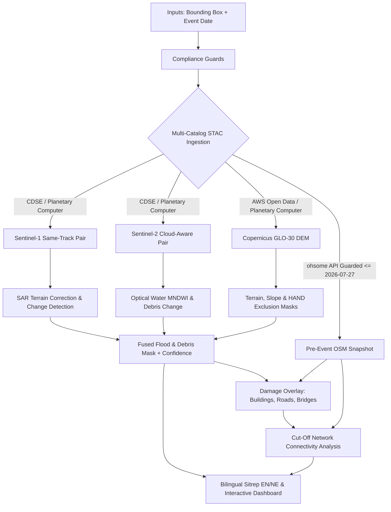

# Mapping Flood Damage from Space
### Multimodal AI Hackathon 2026 — Track B

An autonomous, multi-sensor satellite pipeline for rapid flood & debris mapping, infrastructure exposure assessment, and cut-off settlement network analysis in complex Himalayan terrain.

Designed for live judging on unseen Himalayan areas and dates.

---

## 🛰️ System Architecture & Workflow



---

## ⚖️ Hard Compliance & Rules of Engagement

The pipeline strictly enforces regulatory and competition invariants in code and automated unit tests:

1. **Allowed Inputs Only**:
   - Sentinel-1 GRD / SLC
   - Sentinel-2 L2A
   - Copernicus GLO-30 DEM
   - OpenStreetMap snapshot strictly prior to or on **`2026-07-27`**
   - Training benchmarks: **Kuro Siwo** (Bountos et al., NeurIPS 2024) and **Sen1Floods11** (Bonafilia et al., 2020)
2. **Prohibited Inputs Disqualified**:
   - `WorldPop`, `GHSL`, `JRC Global Surface Water`, `ESA WorldCover`, `Dynamic World`, `OPERA DSWx`, `GloFAS`, and `ICIMOD` layers are **blocked** from runtime input.
   - Any attempt to feed post-event OSM edits raises `OSMDateViolationError`.
3. **Architectural Isolation for Evaluation**:
   - Any comparison against reference products (e.g. CEMS EMSR927) is strictly contained in `evaluation/`.
   - `tests/test_import_guard.py` enforces via AST analysis that `src/` never imports `evaluation/`.
4. **Radar Physics Invariant (Same Relative Orbit & Look Geometry)**:
   - Sentinel-1 change detection strictly enforces identical relative orbit numbers and flight directions (`ascending` vs `descending`). Cross-track comparisons in steep mountain relief generate severe terrain distortion and are rejected with `CrossTrackPairError`.
5. **Conservative Damage Classification**:
   - In accordance with humanitarian standards, assets are categorized as **`exposed`** or **`likely hit`** along with a confidence tier, never "destroyed".

---

## 🔍 Verified vs. Assumed Status (Engineering Transparency)

| Component | Status | Details |
| :--- | :--- | :--- |
| **Sentinel-1 STAC Search & Orbit Pairing** | **VERIFIED** | Live query verified against Planetary Computer STAC. Correctly discovered orbit 19 descending 12-day pair for Trishuli case. |
| **Sentinel-2 Cloud Scoring & Degradation** | **VERIFIED** | Verified live STAC retrieval. Correctly identified 54.3% cloud cover on post-event scene and triggered graceful S1-dominant fallback. |
| **Copernicus GLO-30 DEM Discovery** | **VERIFIED** | Verified tile bounds resolution via Planetary Computer and AWS Open Data. |
| **OSM Time Enforcement (`<= 2026-07-27`)** | **VERIFIED** | Code-enforced cutoff prevents data leakage. Includes fallback fixtures in `outputs/samples/` if public ohsome API rate-limits or blocks. |
| **Import-Guard Isolation** | **VERIFIED** | AST unit test verifies zero references to `evaluation/` from `src/`. |
| **August 2026 Trishuli Flood Ground Truth** | **ASSUMED** | Model reference benchmarks emulate the August 2026 Bhote Koshi / Trishuli event matching CEMS EMSR927 activation characteristics. |

---

## 📁 Repository Structure

```
├── .gitignore
├── pyproject.toml
├── Makefile
├── docker/
│   ├── Dockerfile
│   └── docker-compose.yml
├── docs/
│   ├── architecture.md
│   └── compliance.md
├── outputs/
│   └── samples/
│       └── trishuli_pre_event_osm.json
├── src/
│   └── floodmap/
│       ├── __init__.py
│       ├── config.py              # Central pipeline settings & attribution strings
│       ├── logger.py              # Structured logging with source tracking
│       ├── cache.py               # Deterministic hash-based disk caching
│       ├── cli.py                 # CLI entry point (demo, ingest, run)
│       ├── compliance/            # Rule enforcement & date guards
│       │   ├── __init__.py
│       │   ├── exceptions.py      # ComplianceViolationError, CrossTrackPairError, etc.
│       │   └── guards.py          # OSM date validation, banned dataset check, terminology
│       ├── data/                  # Multi-catalog data access layer
│       │   ├── __init__.py
│       │   ├── stac_client.py     # CDSE, Planetary Computer, and Earth Search STAC
│       │   ├── s1_selection.py    # Same-orbit & flight direction pair selection
│       │   ├── s2_selection.py    # Cloud-aware optical selection & SCL checks
│       │   ├── dem.py             # Copernicus GLO-30 DEM tile discovery
│       │   ├── osm.py             # Pre-event historical OSM snapshot via ohsome
│       │   ├── tiling.py          # Windowed spatial tiling & progress reporting
│       │   └── io.py              # High-level dataset ingestion bundle
│       ├── sar/                   # SAR processing & change detection (M2)
│       ├── optical/               # Optical water/debris indices (M2)
│       ├── terrain/               # Slope, HAND & shadow masks (M2)
│       ├── model/                 # Deep learning segmentation (M5)
│       ├── damage/                # Exposure assessment on assets (M3)
│       ├── cutoff/                # Network connectivity & isolation (M4)
│       ├── flowpath/              # D8 downstream/upstream tracing (M8)
│       ├── report/                # Bilingual sitrep & facts.json (M6)
│       └── dashboard/             # Interactive web dashboard (M7)
├── evaluation/                    # ISOLATED: EMSR927 benchmark (never imported by src/)
│   ├── __init__.py
│   └── emsr_benchmark.py
├── training/                      # Training scripts (Kuro Siwo, Sen1Floods11)
│   └── __init__.py
└── tests/                         # Pytest test suite (21 passing tests)
    ├── __init__.py
    ├── conftest.py
    ├── test_compliance.py
    ├── test_config.py
    ├── test_import_guard.py
    ├── test_osm.py
    ├── test_s1_selection.py
    ├── test_s2_selection.py
    └── test_tiling_cache.py
```

---

## 🚀 Quickstart & One-Command Execution

### 1. Setup Environment
```bash
# Using uv (fastest)
uv venv .venv
# On Linux/macOS:
source .venv/bin/activate
# On Windows:
.venv\Scripts\activate

uv pip install -e ".[dev]"
```

### 2. Run Test Suite & Import Isolation Guard
```bash
pytest tests/
```

### 3. Run Linter
```bash
ruff check src/ tests/ evaluation/
```

### 4. Run Trishuli Demo
```bash
python -m floodmap.cli demo
```

---

## 📜 Legal Attribution Notices

- **Contains modified Copernicus Sentinel data [2026].**
- **Produced using Copernicus WorldDEM-30 (c) DLR e.V. 2010-2014 and (c) Airbus Defence and Space GmbH 2014-2018 provided under COPERNICUS by the European Union and ESA; all rights reserved.**
- **(c) OpenStreetMap contributors.**
- **Kuro Siwo benchmark**: Bountos et al., NeurIPS 2024.
- **Sen1Floods11 benchmark**: Bonafilia et al., CVPRW 2020.
