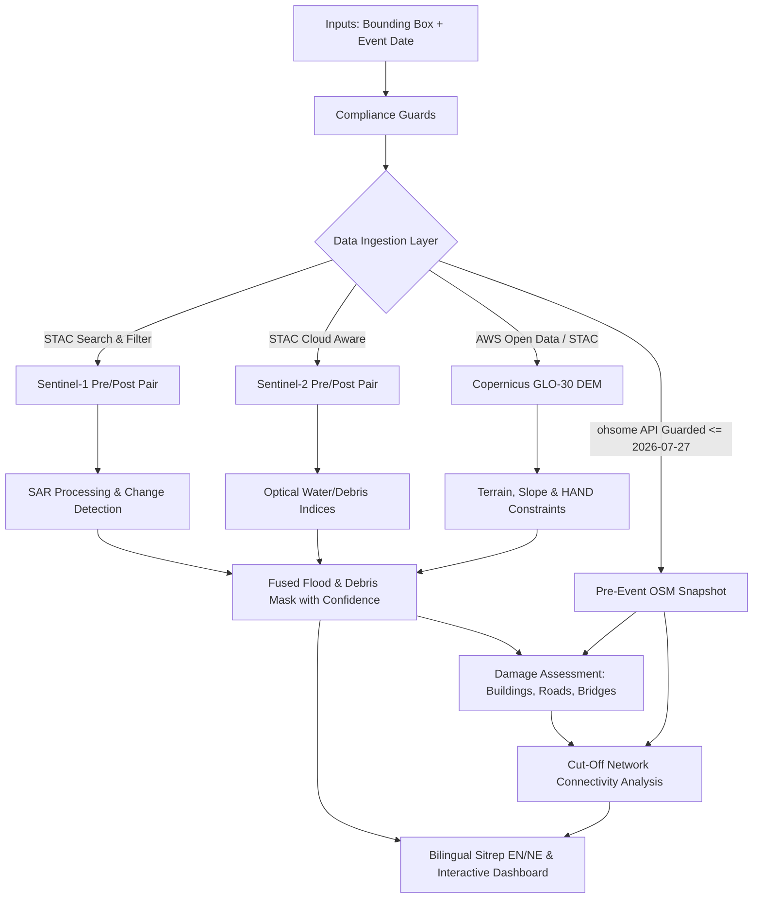

# Architecture Overview: Mapping Flood Damage from Space

## System Pipeline

## Hard Invariants
1. **Input Restrictions**: Only Sentinel-1, Sentinel-2, Copernicus DEM (GLO-30), OSM (<= 2026-07-27), and designated datasets (Kuro Siwo, Sen1Floods11).
2. **Evaluation Isolation**: Reference validation (EMSR927) is strictly isolated within `evaluation/` and never imported by runtime packages.
3. **Same-Orbit Rule**: Sentinel-1 pre/post pairs must share the exact same relative orbit and flight direction. Cross-track pairs are hard-rejected.
4. **Terminology**: Only "exposed" or "likely hit" classifications with explicit confidence tiers. Never "destroyed".
5. **Auditable Numbers**: Every statistic in sitrep and outputs derives directly from structured `facts.json`.
